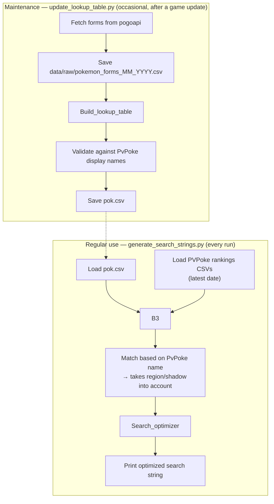

# PvP Search Strings

Generates an optimized Pokémon GO in-game search string for the top-ranked
Pokémon in each PvP league (Little, Great, Ultra, Master), based on
[PvPoke](https://pvpoke.com/) rankings. Instead of checking PvPoke for good species and going through your storage one by one,
just paste the generated string into the game's search bar and it filters straight to them. 
This project created a database of search strings which include forms (galar, alolan, etc.) and shadow forms.
By using a CNF-based search string optimizer, these can be searched for and combined in relatively short single string.

## How it works

1. **`data/processed/pok.csv`** is a lookup table mapping every
   `(Pokémon, form, shadow)` combination to its PvPoke display name and
   the raw Pokémon GO search string that matches it (e.g.
   `957,958,959&!shadow`).
2. **`scripts/generate_search_strings.py`** reads the current PvPoke
   rankings CSVs, looks up each top Pokémon's search string in `pok.csv`,
   and combines them all into one optimized string using a small CNF
   (conjunctive normal form) simplifier — see `src/search_optimizer.py`.
3. **`scripts/update_lookup_table.py`** rebuilds `pok.csv` from scratch.
   You only need this after a Pokémon GO content update adds new species
   or forms.

## Setup

```bash
pip install -r requirements.txt
```

Download the "overall rankings" CSV for each league from PvPoke's
rankings pages and put them in `data/raw/` (any filename matching
`cp500_little_overall_rankings_*.csv`, `cp1500_all_overall_rankings_*.csv`,
`cp2500_all_overall_rankings_*.csv`, `cp10000_all_overall_rankings_*.csv`
works — the most recently downloaded one is picked automatically).

## Usage

Generate search strings for the top 30 Pokémon in each league:

```bash
python scripts/generate_search_strings.py
```

Adjust how many Pokémon per league:

```bash
python scripts/generate_search_strings.py --top 20
```

## Updating after a game update

```bash
# Fetch a fresh forms list and rebuild pok.csv, only hitting PokeAPI
# for evolution lines of newly-added Pokémon.
python scripts/update_lookup_table.py --fetch-forms

# Force a full re-fetch of every evolution line (slow, rarely needed).
python scripts/update_lookup_table.py --fetch-forms --fetch-evolutions
```

The script prints any Pokémon in the current rankings that it couldn't
match to a `pok.csv` entry, which usually means a new form needs a
naming exception added to `config/forms.py`.

## Project layout

```
config/forms.py                 # Static form/name/evolution exception data
src/search_optimizer.py         # Pure CNF search-string combiner (tested)
src/lookup_table.py             # Builds pok_df: naming + search strings
src/league_search_strings.py    # Resolves a league's ranked list -> search strings
src/rankings.py                 # Loads PvPoke rankings CSVs
src/fetch_pogoapi.py            # One-time pogoapi.net form fetch
src/fetch_evolutions.py         # One-time PokeAPI evolution-line fetch
scripts/generate_search_strings.py   # Main entry point
scripts/update_lookup_table.py       # Maintenance entry point
tests/test_search_optimizer.py       # Unit tests for the optimizer
data/raw/                       # Downloaded rankings + forms CSVs (gitignored by default)
data/processed/pok.csv          # The lookup table
```

## Workflow



## Running tests

```bash
pytest tests/
```